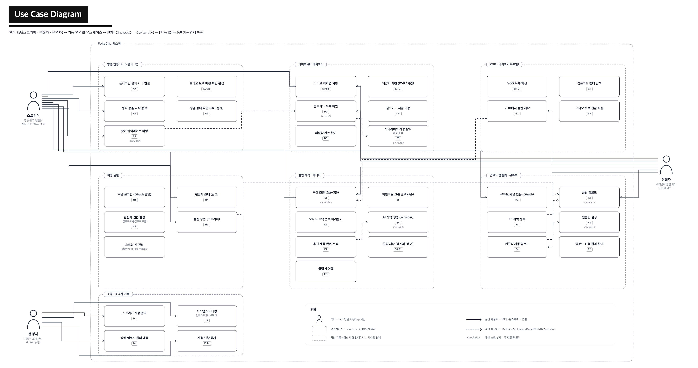
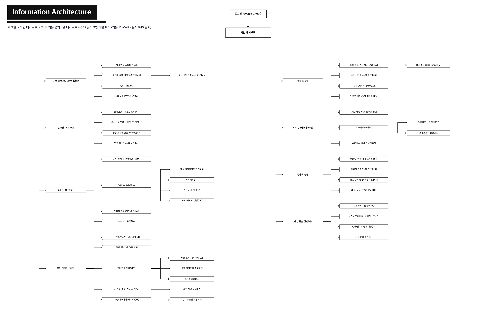
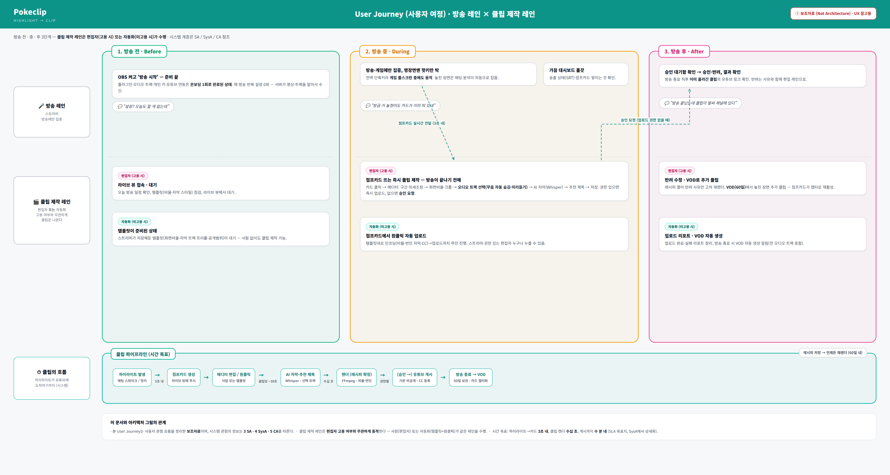
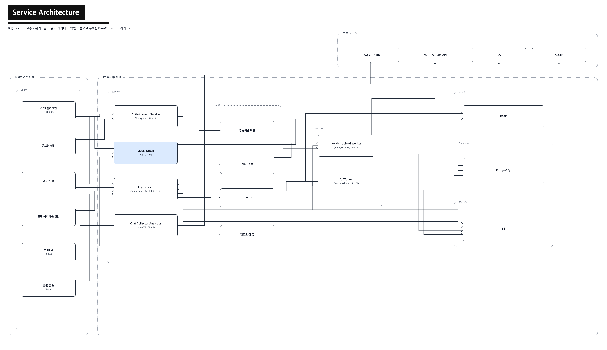
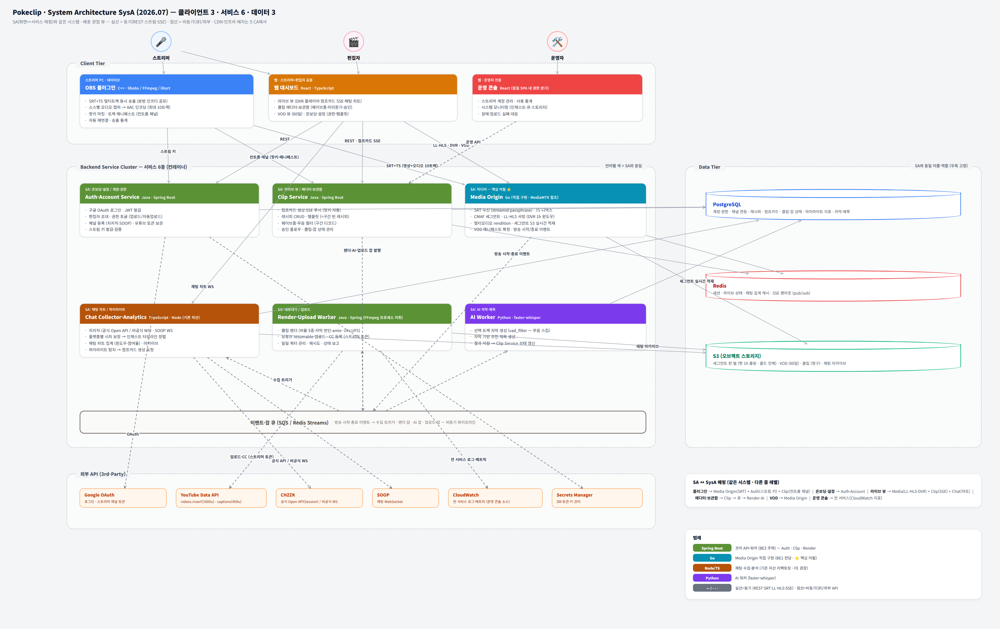
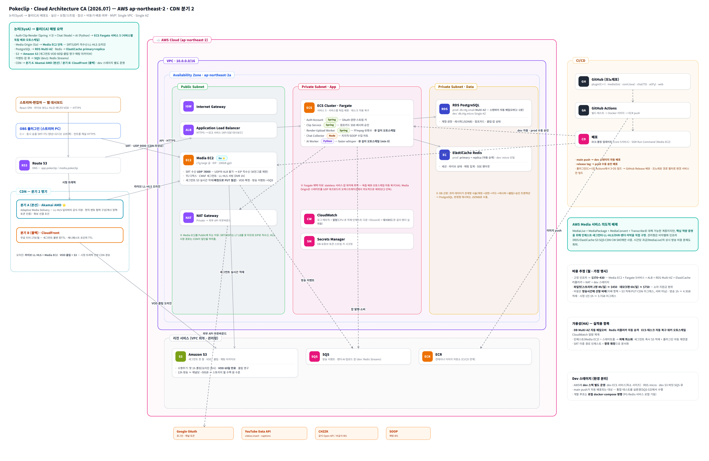
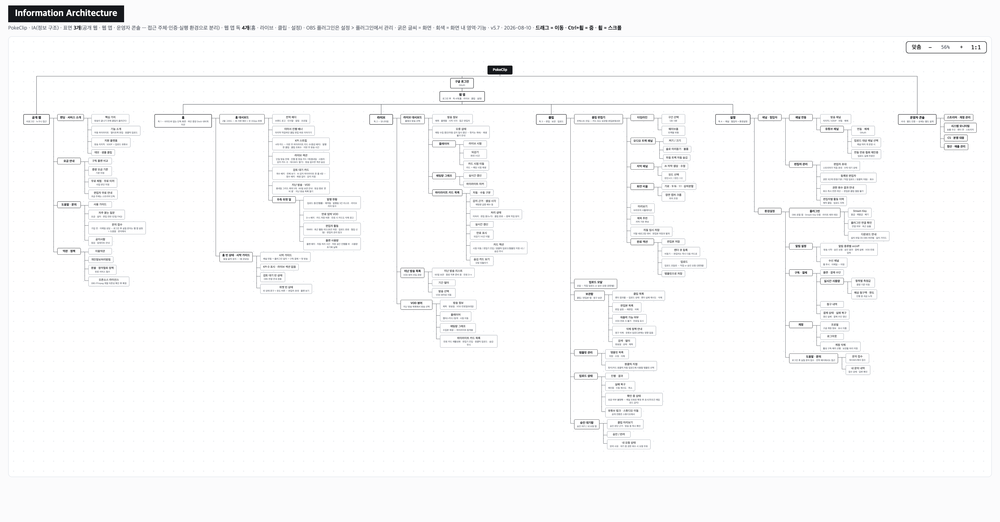

# PokeClip — 아키텍처 산출물

스트리밍 하이라이트·클립 자동화 서비스 **PokeClip**의 설계 산출물 저장소.

OBS 플러그인이 본방(치지직/SOOP)과 병행으로 멀티오디오(6트랙) 방송을 SRT+MPEG-TS로 동시 송출하고, 채팅 반응 분석으로 하이라이트를 실시간 포착해 **방송이 끝나기 전에 클립이 올라가는** — 그것도 브금(BGM) 없는 트랙 조합으로 — 파이프라인을 목표로 한다. 치지직 타임머신·클립 기능을 벤치마킹.

## 산출물

| # | 산출물 | 파일 |
|---|---|---|
| 0 | 유스케이스 다이어그램 | [PNG](0_Pokeclip_UseCase.png) · [HTML](0_Pokeclip_UseCase.html) |
| 1 | IA (정보 구조) | [PNG](1_Pokeclip_IA.png) · [HTML](1_Pokeclip_IA.html) |
| 2 | 유저 저니 | [PNG](2_Pokeclip_UserJourney.png) · [HTML](2_Pokeclip_UserJourney.html) |
| 3 | SA (서비스 아키텍처) | [PNG](3_Pokeclip_SA.png) · [HTML](3_Pokeclip_SA.html) |
| 4 | SysA (시스템 아키텍처) | [PNG](4_Pokeclip_SysA.png) · [HTML](4_Pokeclip_SysA.html) |
| 5 | CA (클라우드 아키텍처, AWS · Target Production) | [PNG](5_Pokeclip_CA.png) · [HTML](5_Pokeclip_CA.html) · 설계 노트는 **팀 위키 `PokeClip-LLM-WIKI` `specs/`** |
| 6 | 설계 결정 인덱스 (ADR 현황판) | **팀 위키 `PokeClip-LLM-WIKI` `specs/`** + 위키 `decisions.md` |
| 7 | 기획서 (사업 — 소마 심사용) | 작성 예정 |
| 8 | 하이라이트 탐지 연구 노트 (팀 실측) | **팀 위키 `PokeClip-LLM-WIKI` `specs/`** |
| 9 | 기능 명세서 (기술 멘토 리뷰용) | **팀 위키 `PokeClip-LLM-WIKI` `specs/`** |
| 10 | 데이터 플로우 (SQS·DB 설계 초안) | **팀 위키 `PokeClip-LLM-WIKI` `specs/`** |
| 11 | 역할 분담 (3인 · 인터페이스 계약) | **팀 위키 `PokeClip-LLM-WIKI` `specs/`** |
| 12 | M1 수직 슬라이스 실행 계획 | **팀 위키 `PokeClip-LLM-WIKI` `specs/`** |
| — | 웹 IA — 대시보드 정보 구조 (v5.7 · 2026-08-10) | [PNG](WebIA.png) · [HTML](WebIA.html) |
| — | 결정별 ADR | **팀 위키 `PokeClip-LLM-WIKI` `adr/`** — 이 저장소에는 없다([경위](adr/README.md)) |

다이어그램은 self-contained HTML로 작성 후 PNG로 렌더링한다(HTML이 원본). **이 저장소가 맡는 것은 다이어그램 산출물(PNG·HTML)뿐이다** — 서술형 설계 문서·ADR·계약의 정본은 2026-07-31에 팀 위키 `PokeClip-LLM-WIKI`로 이관됐다. 경위와 갈 곳은 [`adr/README.md`](adr/README.md)·[`contracts/README.md`](contracts/README.md).

다이어그램 편집·생성은 draw.io로 직접 한다. 자체 제작 라우팅 엔진(`site/`·`labs/`)은 2026-08-20 폐기했다 — draw.io 공식 도구가 대체한다. 되살릴 일이 생기면 git 이력에 남아 있다.

## 다이어그램 미리보기

### 0. 유스케이스

### 1. IA

### 2. 유저 저니

### 3. 서비스 아키텍처

### 4. 시스템 아키텍처

### 5. 클라우드 아키텍처 (AWS ap-northeast-2)

### 웹 IA (대시보드 · v5.7)

## 참고 자료

`*_FillMap_*.png` 는 산출물 형식 참고용 레퍼런스 다이어그램(타 프로젝트 예시)이다.
